# 🏗️ KLCP Quiz App - Technische Dokumentation

**Version:** 2.0.0 | **Datum:** 28. Dezember 2025
**Entwickler:** Halil Yücedag
**Technologie:** Android (Kotlin) + Node.js Server

---

## 📋 Inhaltsverzeichnis

1. [🏗️ System-Architektur](#system-architektur)
2. [📱 Android App](#android-app)
3. [🖥️ Server-Backend](#server-backend)
4. [💾 Datenbank-Schema](#datenbank-schema)
5. [🔌 API-Schnittstellen](#api-schnittstellen)
6. [🚀 Deployment & Server](#deployment--server)
7. [🔒 Sicherheit](#sicherheit)
8. [🧪 Testing & QA](#testing--qa)
9. [🔧 Troubleshooting](#troubleshooting)
10. [📊 Monitoring & Analytics](#monitoring--analytics)

---

## 🏗️ System-Architektur

### Übersicht

Die KLCP Quiz App ist eine moderne, hybride Anwendung bestehend aus:

- **Android App** (Kotlin, Material Design 3) - Client-Anwendung
- **Node.js Server** (Express.js, SQLite) - Backend-API
- **Hetzner VPS** (Ubuntu 24.04.3 LTS) - Hosting-Umgebung

**Projekt-Größe:**
- **375 KLCP-Fragen** (Deutsch + Englisch)
- **10+ UI-Screens** mit komplexer Navigation
- **6 Datenbank-Tabellen** mit Beziehungen
- **15+ API-Endpoints** für Sync & Auth
- **Offline-First** Architektur mit lokaler Datenbank

### Kommunikationsfluss

```mermaid
graph TD
    A[📱 Android App] -->|HTTPS/WSS| B[🌐 Nginx Proxy :443]
    B -->|HTTP| C[🖥️ Express Server :3000]
    C -->|SQLite| D[(💾 klcp_quiz.db)]
    C -->|JWT Auth| E[🔐 User Sessions]
    C -->|File I/O| F[📁 Local Storage]

    subgraph "Hetzner VPS"
        B
        C
        D
        E
        F
    end
```



**Netzwerk-Details:**
- **Primäre Verbindung:** `https://klcp.alie.info` (SSL/TLS 1.3)
- **Fallback:** `http://188.245.153.241:3000` (HTTP direkt)
- **Lokale Entwicklung:** `http://localhost:3000`
- **Timeout:** 10s Connect, 30s Read/Write
- **Retry-Logic:** 3 Versuche mit Exponential Backoff

### Netzwerk-Konfiguration

**Primäre URLs:**
- **Produktion:** `https://klcp.alie.info`
- **Direkt:** `http://188.245.153.241:3000`
- **Lokale Entwicklung:** `http://localhost:3000`

**Fallback-Mechanismus:**
1. `https://klcp.alie.info` (Haupt-URL)
2. `https://188.245.153.241` (HTTPS IP)
3. `http://188.245.153.241:3000` (HTTP direkt)
4. Lokale URLs (Entwicklung)

---

## 📱 Android App

### Technischer Stack

| Komponente | Version | Zweck | Status |
|------------|---------|-------|--------|
| **Kotlin** | 2.0.21 | Programmiersprache | ✅ Stabil |
| **Android SDK** | 35 (API 26+) | Plattform | ✅ Target 35, Min 26 |
| **Material Design 3** | Dynamic Colors | UI Framework | ✅ Vollständig implementiert |
| **Room** | 2.6.1 | Lokale Datenbank | ✅ Version 6 (Multi-User) |
| **Retrofit** | 2.9.0 | HTTP Client | ✅ Mit Retry-Interceptor |
| **DataStore** | 1.1.1 | Preferences | ✅ Proto DataStore |
| **Coroutines** | 1.8.1 | Asynchrone Programmierung | ✅ Flow + StateFlow |
| **Navigation** | 2.9.6 | Screen-Navigation | ✅ Safe Args |
| **LiveData** | - | UI State | ⚠️ Wird durch StateFlow ersetzt |
| **ViewModel** | - | MVVM | ✅ AndroidViewModel |
| **Splash Screen API** | 1.0.1 | Native Splash | ✅ Android 12+ |
| **Glide** | 4.16.0 | Image Loading | ✅ In Utils implementiert |

**Build-Konfiguration:**
- **Gradle Version:** 8.12.3 (Kotlin DSL)
- **KSP:** Kotlin Symbol Processing für Room
- **Safe Args:** Type-sichere Navigation
- **ProGuard:** Code-Optimierung (Release)

### Detaillierte App-Architektur

```
app/src/main/java/alie/info/newmultichoice/
├── 📱 ui/                          # UI Layer (10+ Fragments)
│   ├── home/                      # Start-Screen + Navigation
│   │   ├── HomeFragment.kt        # Haupt-Dashboard (200+ Zeilen)
│   │   └── HomeViewModel.kt       # UI-Logic (100+ Zeilen)
│   ├── quiz/                      # Quiz-Core (Komplexeste Komponente)
│   │   ├── QuizFragment.kt        # Quiz-UI (750+ Zeilen)
│   │   ├── QuizViewModel.kt       # State Management (770+ Zeilen)
│   │   └── QuizUiState.kt         # Sealed Classes für States
│   ├── result/                    # Ergebnis-Anzeige
│   │   └── ResultFragment.kt      # Score + Statistiken (150+ Zeilen)
│   ├── auth/                      # Authentifizierung (Neu hinzugefügt)
│   │   └── AuthFragment.kt        # Login/Register UI (200+ Zeilen)
│   ├── statistics/                # Daten-Analyse
│   │   ├── StatisticsFragment.kt  # Charts + KPIs (180+ Zeilen)
│   │   └── StatisticsViewModel.kt # Daten-Aggregation (120+ Zeilen)
│   ├── sessions/                  # Session-Historie
│   │   ├── SessionsFragment.kt    # RecyclerView (130+ Zeilen)
│   │   ├── SessionsAdapter.kt     # List-Darstellung (80+ Zeilen)
│   │   └── SessionsViewModel.kt   # Session-Management (90+ Zeilen)
│   └── examquiz/                  # Prüfungs-Modus
│       └── ExamQuizFragment.kt    # Vollständige Prüfung (200+ Zeilen)
├── 💾 data/                       # Data Layer (Repository Pattern)
│   ├── QuizDatabase.kt           # Room DB (6 Entities, Version 6)
│   ├── QuizRepository.kt         # Single Source of Truth (400+ Zeilen)
│   ├── Question.kt               # Datenmodell (Basis-Entity)
│   ├── QuizSession.kt            # Session-Tracking
│   ├── UserAnswer.kt             # Antwort-Historie
│   ├── UserStats.kt              # Aggregierte Statistiken
│   ├── KaliTool.kt               # Erweiterte Features
│   ├── PreferencesManager.kt     # DataStore Wrapper (80+ Zeilen)
│   ├── MemoryCache.kt            # In-Memory Cache (50+ Zeilen)
│   └── [QuizDao.kt, UserStatsDao.kt, etc.] # Room DAOs (6 Dateien)
├── 🔌 api/                       # Network Layer
│   ├── ApiService.kt             # Retrofit Service (15 Endpoints)
│   ├── AuthApiService.kt         # Auth-spezifische Calls (7 Endpoints)
│   ├── RetrofitClient.kt         # HTTP Client Config (Fallback-Logic)
│   ├── NetworkRetryInterceptor.kt # Retry + Fallback Logic (130+ Zeilen)
│   └── models/                   # API DTOs (20+ Klassen)
├── 🛠️ utils/                      # Utilities (7 Klassen)
│   ├── HapticFeedbackHelper.kt   # Vibration Patterns (6 Typen)
│   ├── ImageLoader.kt            # Glide Wrapper (60+ Zeilen)
│   ├── DeviceUtils.kt            # Device-ID Generation (40+ Zeilen)
│   ├── Logger.kt                 # Custom Logging (30+ Zeilen)
│   └── ShareHelper.kt            # Social Sharing (50+ Zeilen)
├── 🎯 auth/                      # Authentifizierung (Neu)
│   └── AuthManager.kt            # JWT + Session Management (100+ Zeilen)
└── 📊 overlays/                   # UI Overlays
    └── OverlayManager.kt         # Fullscreen Overlays (60+ Zeilen)
```

**Code-Statistik (Realistisch):**
- **81 Kotlin-Dateien** im Hauptverzeichnis
- **750+ Zeilen** QuizFragment (komplexeste UI-Komponente)
- **770+ Zeilen** QuizViewModel (komplexeste Business-Logic)
- **400+ Zeilen** QuizRepository (datenintensivste Klasse)
- **375 Fragen** bilingual (DE/EN) in assets/questions.json
- **6 Datenbank-Versionen** (Migrations-Historie)
- **15+ API-Endpoints** für Sync & Auth
- **10+ UI-Screens** mit komplexer Navigation

### Kern-Features

#### 🎯 Quiz-Engine
- **375 KLCP-Fragen** aus offiziellem Fragenkatalog
- **Zweisprachig:** Deutsch & Englisch
- **Sofortiges Feedback** mit Haptic & Visual Effects
- **Progress-Tracking** mit Room Database
- **Session-Management** mit Auto-Save

#### 🎨 Material Design 3
- **Dynamic Colors** (Material You)
- **Dark Mode** Support
- **Edge-to-Edge** Display
- **Haptic Feedback** (6 verschiedene Patterns)
- **Smooth Animations** (Fade, Scale, Shake)

#### 🔄 Sync-System
- **Offline-First** Architektur
- **Automatische Synchronisation** bei Internet-Verbindung
- **Device-ID basierte** User-Identifikation
- **Backup & Restore** Funktionalität

---

## 🖥️ Server-Backend

### Technischer Stack

| Komponente | Version | Zweck | Status |
|------------|---------|-------|--------|
| **Node.js** | 18.0.0 | Runtime | ✅ LTS |
| **Express.js** | 4.18.2 | Web Framework | ✅ Stabil |
| **SQLite3** | 5.1.6 | Datenbank | ✅ Mit WAL-Mode |
| **JWT** | 9.0.2 | Authentifizierung | ⚠️ Secret hardcoded (kritisch!) |
| **bcryptjs** | 2.4.3 | Passwort-Hashing | ✅ Salt Rounds: 12 |
| **Helmet** | 7.1.0 | Security Headers | ✅ Konfiguriert |
| **CORS** | 2.8.5 | Cross-Origin | ⚠️ Erlaubt alle Origins (kritisch!) |
| **express-rate-limit** | 7.1.5 | Rate Limiting | ✅ 100 req/15min |
| **UUID** | 9.0.1 | ID Generation | ✅ v4 |
| **Nodemailer** | 6.9.7 | Email | ⚠️ Nicht konfiguriert |

### Server-Datei-Struktur (Realistisch)

```
test_server/
├── 🖥️ server.js              # Haupt-Server (110 Zeilen)
│   ├── Express App Setup
│   ├── Middleware Konfiguration
│   ├── Route-Registrierung
│   └── Graceful Shutdown
├── 🔐 authRoutes.js          # Authentifizierung (270+ Zeilen)
│   ├── POST /register        # User-Registrierung
│   ├── POST /login           # User-Login
│   ├── POST /verify-email    # Email-Verifikation
│   ├── DELETE /account       # Account-Löschung
│   └── JWT Token Handling
├── 🔄 syncRoutes.js          # Daten-Sync (200+ Zeilen)
│   ├── POST /upload          # Client → Server Sync
│   ├── GET /download/:id     # Server → Client Sync
│   └── Conflict Resolution
├── 📊 statsRoutes.js         # Statistiken (150+ Zeilen)
│   ├── GET /user/:id         # User-Stats abrufen
│   ├── POST /update          # Stats aktualisieren
│   ├── GET /unlock-status    # Achievement-Status
│   └── GET /exam-unlock      # Prüfungs-Freischaltung
├── 📅 sessionsRoutes.js      # Sessions (100+ Zeilen)
│   ├── GET /:id              # Session-Liste
│   ├── POST /save            # Session speichern
│   └── POST /check-guest     # Guest-Upgrade prüfen
├── 💾 backupRoutes.js        # Backup-System (80+ Zeilen)
│   ├── POST /create          # Backup erstellen
│   └── GET /restore/:id      # Backup wiederherstellen
├── 🗄️ database.js            # DB-Verbindung (60+ Zeilen)
│   ├── SQLite Connection
│   ├── Query Wrapper
│   └── Error Handling
├── 📦 package.json           # Dependencies (15 Pakete)
└── 🔐 .env                   # Konfiguration (falls vorhanden)
```

**Server-Metriken:**
- **8 Route-Dateien** mit modularer Struktur
- **15+ API-Endpoints** implementiert
- **270+ Zeilen** Auth-Logic (komplexeste Datei)
- **SQLite** als Datei-basiertes DB-System
- **JWT-Authentifizierung** mit Email-Verifikation
- **Rate Limiting** auf Route-Ebene

### Server-Konfiguration

```javascript
// server.js - Wichtige Einstellungen
const PORT = process.env.PORT || 3000;
const JWT_SECRET = process.env.JWT_SECRET;
const NODE_ENV = process.env.NODE_ENV || 'development';

// Security Middleware
app.use(helmet({
  crossOriginResourcePolicy: { policy: "cross-origin" }
}));

// Rate Limiting
const limiter = rateLimit({
  windowMs: 15 * 60 * 1000, // 15 Minuten
  max: 100, // Max 100 Requests pro IP
  message: 'Too many requests from this IP'
});

// Auth Rate Limiting (strenger)
const authLimiter = rateLimit({
  windowMs: 15 * 60 * 1000,
  max: 10, // Max 10 Auth-Versuche
  message: 'Too many authentication attempts'
});
```

---

## 💾 Datenbank-Schema

### SQLite Database Structure

```sql
-- Haupt-Datenbank: klcp_quiz.db
-- Version: 6 (Multi-User Support hinzugefügt)

-- Benutzer-Tabelle
CREATE TABLE users (
    id INTEGER PRIMARY KEY AUTOINCREMENT,
    email TEXT UNIQUE NOT NULL,
    password_hash TEXT NOT NULL,
    created_at DATETIME DEFAULT CURRENT_TIMESTAMP,
    verified BOOLEAN DEFAULT 0,
    verification_token TEXT,
    device_id TEXT UNIQUE
);

-- Fragen-Tabelle
CREATE TABLE questions (
    id INTEGER PRIMARY KEY,
    question_en TEXT NOT NULL,
    question_de TEXT NOT NULL,
    option_a_en TEXT NOT NULL,
    option_b_en TEXT NOT NULL,
    option_c_en TEXT NOT NULL,
    option_d_en TEXT NOT NULL,
    option_a_de TEXT NOT NULL,
    option_b_de TEXT NOT NULL,
    option_c_de TEXT NOT NULL,
    option_d_de TEXT NOT NULL,
    correct_answer TEXT NOT NULL,
    category TEXT,
    difficulty TEXT
);

-- Quiz-Sessions
CREATE TABLE quiz_sessions (
    id INTEGER PRIMARY KEY AUTOINCREMENT,
    user_id TEXT NOT NULL,
    device_id TEXT NOT NULL,
    total_questions INTEGER NOT NULL,
    correct_answers INTEGER NOT NULL,
    wrong_answers INTEGER NOT NULL,
    percentage REAL NOT NULL,
    duration_minutes INTEGER,
    timestamp DATETIME DEFAULT CURRENT_TIMESTAMP,
    language TEXT DEFAULT 'en'
);

-- User-Antworten (für Analyse)
CREATE TABLE user_answers (
    id INTEGER PRIMARY KEY AUTOINCREMENT,
    session_id INTEGER NOT NULL,
    question_id INTEGER NOT NULL,
    user_answer TEXT NOT NULL,
    correct_answer TEXT NOT NULL,
    is_correct BOOLEAN NOT NULL,
    timestamp DATETIME DEFAULT CURRENT_TIMESTAMP,
    FOREIGN KEY (session_id) REFERENCES quiz_sessions(id)
);

-- User-Statistiken
CREATE TABLE user_stats (
    id INTEGER PRIMARY KEY AUTOINCREMENT,
    device_id TEXT UNIQUE NOT NULL,
    total_quizzes INTEGER DEFAULT 0,
    total_correct INTEGER DEFAULT 0,
    total_questions INTEGER DEFAULT 0,
    average_percentage REAL DEFAULT 0.0,
    best_score REAL DEFAULT 0.0,
    streak_current INTEGER DEFAULT 0,
    streak_best INTEGER DEFAULT 0,
    last_quiz_date DATETIME,
    achievements_unlocked TEXT DEFAULT '[]',
    created_at DATETIME DEFAULT CURRENT_TIMESTAMP
);

-- Kali Tools (erweitert)
CREATE TABLE kali_tools (
    id INTEGER PRIMARY KEY AUTOINCREMENT,
    name TEXT NOT NULL,
    category TEXT NOT NULL,
    description TEXT NOT NULL,
    main_function TEXT NOT NULL,
    usage_example TEXT,
    flags TEXT,
    prerequisites TEXT,
    created_at DATETIME DEFAULT CURRENT_TIMESTAMP
);
```

### Room Database (Android)

```kotlin
@Database(
    entities = [
        Question::class,
        QuizSession::class,
        UserAnswer::class,
        UserStats::class,
        KaliTool::class
    ],
    version = 6,
    exportSchema = false
)
abstract class QuizDatabase : RoomDatabase() {

    abstract fun questionDao(): QuestionDao
    abstract fun quizSessionDao(): QuizSessionDao
    abstract fun userAnswerDao(): UserAnswerDao
    abstract fun userStatsDao(): UserStatsDao
    abstract fun kaliToolDao(): KaliToolDao

    companion object {
        @Volatile
        private var INSTANCE: QuizDatabase? = null

        fun getDatabase(context: Context): QuizDatabase {
            return INSTANCE ?: synchronized(this) {
                Room.databaseBuilder(
                    context.applicationContext,
                    QuizDatabase::class.java,
                    "klcp_quiz_database"
                )
                    .fallbackToDestructiveMigration()
                    .build().also { INSTANCE = it }
            }
        }
    }
}
```

---

## 🔌 API-Schnittstellen

### Base URLs & Endpoints

**Production:**
- **Primär:** `https://klcp.alie.info/api/` (Nginx Reverse Proxy)
- **Direkt:** `http://188.245.153.241:3000/api/` (Express direkt)
- **Lokale Entwicklung:** `http://localhost:3000/api/`

**Endpoint-Übersicht:** 15+ aktive Endpoints

**Rate Limits:**
- **Global:** 100 Requests/15 Minuten pro IP
- **Auth:** 10 Requests/15 Minuten pro IP
- **Health:** Unbegrenzt

### Authentifizierung Endpoints

#### `POST /api/auth/login`
**Rate Limit:** 10/15min | **Auth:** Keine

**Request:**
```json
{
  "email": "user@example.com",
  "password": "password123"
}
```

**Response (Success):**
```json
{
  "success": true,
  "token": "eyJhbGciOiJIUzI1NiIsInR5cCI6IkpXVCJ9...",
  "userId": "user_uuid",
  "email": "user@example.com"
}
```

**Response (Error):**
```json
{
  "success": false,
  "message": "Invalid email or password"
}
```

#### `POST /api/auth/register`
**Rate Limit:** 10/15min | **Auth:** Keine

**Request:**
```json
{
  "email": "user@example.com",
  "password": "secure_password_123"
}
```

**Response (Success):**
```json
{
  "success": true,
  "message": "Registration successful, please verify email",
  "userId": "user_uuid"
}
```

**Response (Error - Email exists):**
```json
{
  "success": false,
  "message": "Email already registered"
}
```

#### `POST /api/auth/verify-email`
**Rate Limit:** 10/15min | **Auth:** Keine

**Request:**
```json
{
  "userId": "user_uuid",
  "code": "123456"
}
```

**Response (Success):**
```json
{
  "success": true,
  "message": "Email verified successfully"
}
```

#### `DELETE /api/auth/account`
**Rate Limit:** 10/15min | **Auth:** JWT Required

**Request Headers:**
```
Authorization: Bearer jwt_token_here
```

**Response (Success):**
```json
{
  "success": true,
  "message": "Account deleted successfully"
}
```

### Sync Endpoints

#### `POST /api/sync/upload`
**Rate Limit:** 100/15min | **Auth:** Keine (Device-ID basiert)

**Request (Vollständig):**
```json
{
  "deviceId": "550e8400-e29b-41d4-a716-446655440000",
  "userStats": {
    "totalQuizzes": 15,
    "totalCorrect": 1200,
    "totalQuestions": 1500,
    "averagePercentage": 85.5,
    "bestScore": 95.2,
    "streakCurrent": 3,
    "streakBest": 8,
    "lastQuizDate": "2025-12-28T09:30:00Z",
    "achievementsUnlocked": ["first_quiz", "perfect_score", "speed_demon"]
  },
  "quizSessions": [
    {
      "totalQuestions": 50,
      "correctAnswers": 42,
      "wrongAnswers": 8,
      "percentage": 84.0,
      "durationMinutes": 25,
      "timestamp": "2025-12-28T09:30:00Z",
      "language": "en"
    }
  ],
  "lastSync": "2025-12-27T15:00:00Z"
}
```

**Response (Success):**
```json
{
  "success": true,
  "serverTime": "2025-12-28T10:05:00Z",
  "dataSynced": true,
  "syncId": "sync_12345"
}
```

**Response (Partial Sync):**
```json
{
  "success": true,
  "serverTime": "2025-12-28T10:05:00Z",
  "dataSynced": false,
  "error": "Database temporarily unavailable",
  "retryAfter": 300
}
```

#### `GET /api/sync/download/{deviceId}`
**Rate Limit:** 100/15min | **Auth:** Keine

**URL Parameter:**
- `deviceId`: UUID des Geräts (erforderlich)

**Response (Success):**
```json
{
  "success": true,
  "userData": {
    "stats": {
      "totalQuizzes": 15,
      "totalCorrect": 1200,
      "totalQuestions": 1500,
      "averagePercentage": 85.5,
      "bestScore": 95.2,
      "streakCurrent": 3,
      "streakBest": 8,
      "lastQuizDate": "2025-12-28T09:30:00Z",
      "achievementsUnlocked": ["first_quiz", "perfect_score"]
    },
    "sessions": [
      {
        "id": 123,
        "totalQuestions": 50,
        "correctAnswers": 42,
        "wrongAnswers": 8,
        "percentage": 84.0,
        "durationMinutes": 25,
        "timestamp": "2025-12-28T09:30:00Z",
        "language": "en"
      }
    ],
    "lastSync": "2025-12-28T09:30:00Z"
  },
  "serverVersion": "2.0.0"
}
```

**Response (No Data):**
```json
{
  "success": true,
  "userData": null,
  "message": "No data found for this device"
}
```

### Statistiken Endpoints

#### `GET /api/stats/user/{deviceId}`
```json
Response:
{
  "success": true,
  "data": {
    "totalQuizzes": 15,
    "totalCorrect": 1200,
    "averagePercentage": 85.5,
    "bestScore": 95.2,
    "achievementsUnlocked": ["first_quiz", "perfect_score"]
  }
}
```

### Session Management

#### `POST /api/sessions/save`
```json
Request:
{
  "deviceId": "device_uuid",
  "totalQuestions": 50,
  "correctAnswers": 42,
  "wrongAnswers": 8,
  "percentage": 84.0,
  "durationMinutes": 25,
  "language": "en"
}

Response:
{
  "success": true,
  "sessionId": 123
}
```

---

## 🚀 Deployment & Server

### Hetzner VPS Setup (Produktiv)

**Server-Spezifikationen:**
- **IP:** `188.245.153.241`
- **OS:** Ubuntu 24.04.3 LTS (GNU/Linux 6.8.0-90-generic x86_64)
- **CPU:** Shared vCPU
- **RAM:** 2-4 GB
- **Storage:** 40 GB NVMe SSD
- **Node.js:** 18.0.0 LTS
- **Domains:** `klcp.alie.info` (Let's Encrypt SSL)
- **Uptime:** Ziel 99.9%

**Netzwerk-Konfiguration:**
- **Port 80:** Nginx HTTP (Redirect to HTTPS)
- **Port 443:** Nginx HTTPS (SSL/TLS 1.3)
- **Port 3000:** Node.js Express (localhost only)
- **Firewall:** UFW mit strikten Regeln

### Nginx Reverse Proxy (Produktiv-Konfiguration)

**Konfigurations-Datei:** `/etc/nginx/sites-available/klcp.alie.info`

```nginx
# HTTP zu HTTPS Redirect
server {
    listen 80;
    server_name klcp.alie.info www.klcp.alie.info;

    # SEO-friendly Redirect
    return 301 https://klcp.alie.info$request_uri;
}

# HTTPS Haupt-Konfiguration
server {
    listen 443 ssl http2;
    server_name klcp.alie.info;

    # SSL/TLS Konfiguration (Let's Encrypt)
    ssl_certificate /etc/letsencrypt/live/klcp.alie.info/fullchain.pem;
    ssl_certificate_key /etc/letsencrypt/live/klcp.alie.info/privkey.pem;

    # SSL Sicherheit (A+ Rating)
    ssl_protocols TLSv1.2 TLSv1.3;
    ssl_ciphers ECDHE-RSA-AES128-GCM-SHA256:ECDHE-RSA-AES256-GCM-SHA384;
    ssl_prefer_server_ciphers off;
    ssl_session_cache shared:SSL:10m;
    ssl_session_timeout 10m;

    # Security Headers
    add_header X-Frame-Options "SAMEORIGIN" always;
    add_header X-Content-Type-Options "nosniff" always;
    add_header X-XSS-Protection "1; mode=block" always;
    add_header Strict-Transport-Security "max-age=31536000; includeSubDomains" always;
    add_header Referrer-Policy "strict-origin-when-cross-origin" always;

    # Gzip Kompression
    gzip on;
    gzip_vary on;
    gzip_min_length 1024;
    gzip_types text/plain text/css text/xml text/javascript application/javascript application/xml+rss application/json;

    # API Proxy zu Node.js (localhost only)
    location /api/ {
        # Rate Limiting (zusätzlich zu Express)
        limit_req zone=api burst=10 nodelay;

        # Proxy Konfiguration
        proxy_pass http://127.0.0.1:3000;
        proxy_http_version 1.1;
        proxy_set_header Upgrade $http_upgrade;
        proxy_set_header Connection 'upgrade';
        proxy_set_header Host $host;
        proxy_set_header X-Real-IP $remote_addr;
        proxy_set_header X-Forwarded-For $proxy_add_x_forwarded_for;
        proxy_set_header X-Forwarded-Proto $scheme;
        proxy_cache_bypass $http_upgrade;

        # Timeouts
        proxy_connect_timeout 10s;
        proxy_send_timeout 30s;
        proxy_read_timeout 30s;
    }

    # Health Check (ohne Rate Limiting)
    location /api/health {
        proxy_pass http://127.0.0.1:3000/api/health;
        access_log off;
    }

    # Default Location (404 für nicht-API Requests)
    location / {
        return 404;
    }
}

# WWW Redirect (separater Server Block für bessere Performance)
server {
    listen 443 ssl http2;
    server_name www.klcp.alie.info;

    # Gleiche SSL Konfiguration
    ssl_certificate /etc/letsencrypt/live/klcp.alie.info/fullchain.pem;
    ssl_certificate_key /etc/letsencrypt/live/klcp.alie.info/privkey.pem;

    # Permanent Redirect zu Non-WWW
    return 301 https://klcp.alie.info$request_uri;
}
```

**Nginx-Optimierungen:**
- **HTTP/2** für bessere Performance
- **Gzip-Kompression** für API-Responses
- **Rate Limiting** auf Nginx-Ebene
- **Security Headers** für OWASP Compliance
- **SSL A+ Rating** durch moderne Cipher

### SSH-Zugang (Passwortlos)

**Server-IP:** `188.245.153.241`
**Benutzer:** `root`
**SSH-Key Authentifizierung:** Aktiviert (empfohlen)

#### SSH-Verbindung:

```bash
# Direkte Verbindung (funktioniert nur lokal oder mit VPN)
ssh root@188.245.153.241

# Alternative mit expliziten Parametern
ssh -p 22 root@188.245.153.241

# Mit SSH-Key (empfohlen für Sicherheit)
ssh -i ~/.ssh/klcp_server_key root@188.245.153.241
```

#### SSH-Key Setup (Empfohlen):

```bash
# 1. SSH-Key erstellen (falls nicht vorhanden)
ssh-keygen -t ed25519 -C "klcp-server-access"

# 2. Public Key auf Server kopieren
ssh-copy-id root@188.245.153.241

# 3. SSH-Konfiguration für Sicherheit optimieren
ssh root@188.245.153.241 << 'EOF'
# SSH-Konfiguration anpassen
cat >> /etc/ssh/sshd_config << 'SSH_CONFIG'
# Sicherheit verbessern
PermitRootLogin prohibit-password
PasswordAuthentication no
PubkeyAuthentication yes
ChallengeResponseAuthentication no
UsePAM yes
X11Forwarding no
PrintMotd no
AcceptEnv LANG LC_*
Subsystem sftp /usr/lib/openssh/sftp-server
SSH_CONFIG

# SSH Service neu starten
systemctl restart sshd
EOF
```

### Server-Deployment

```bash
# 1. Code auf Server kopieren
scp -r test_server root@188.245.153.241:/opt/

# 2. Dependencies installieren
cd /opt/test_server
npm install

# 3. Environment konfigurieren
cp .env.example .env
nano .env  # JWT_SECRET, SMTP, etc.

# 4. Service erstellen
sudo nano /etc/systemd/system/klcp-server.service

[Unit]
Description=KLCP Quiz Server
After=network.target

[Service]
Type=simple
User=root
WorkingDirectory=/opt/test_server
ExecStart=/usr/bin/node server.js
Restart=always
RestartSec=10
Environment=NODE_ENV=production

[Install]
WantedBy=multi-user.target

# 5. Service aktivieren
sudo systemctl enable klcp-server
sudo systemctl start klcp-server
sudo systemctl status klcp-server
```

### Environment Variables

```bash
# .env Datei
NODE_ENV=production
PORT=3000
JWT_SECRET=your_super_secure_jwt_secret_here
JWT_EXPIRE=24h

# Email (optional)
SMTP_HOST=smtp.gmail.com
SMTP_PORT=587
SMTP_USER=your_email@gmail.com
SMTP_PASS=your_app_password

# Database
DATABASE_PATH=/opt/test_server/klcp_quiz.db
```

---

## 🔒 Sicherheit

### Kritische Sicherheitsprobleme (MUSS behoben werden!)

#### 🚨 1. SSH Root-Login ohne Passwort
**Status:** Aktiv | **Risiko:** KRITISCH

**Problem:**
```bash
ssh root@188.245.153.241
# Login ohne Passwort möglich!
```

**Lösung:**
```bash
# SSH-Konfiguration ändern (auf Server ausführen)
sudo sed -i 's/PermitRootLogin yes/PermitRootLogin prohibit-password/' /etc/ssh/sshd_config
sudo sed -i 's/PasswordAuthentication yes/PasswordAuthentication no/' /etc/ssh/sshd_config
sudo systemctl restart sshd

# SSH-Key einrichten (auf deinem lokalen Computer)
ssh-keygen -t ed25519 -C "klcp-server-secure"
ssh-copy-id root@188.245.153.241
```

---

#### 🚨 2. Port 3000 öffentlich erreichbar
**Status:** Aktiv | **Risiko:** KRITISCH

**Problem:**
```bash
curl http://188.245.153.241:3000/api/health
# Gibt 200 OK zurück - NICHT SICHER!
```

**Lösung:**
```bash
# Firewall: Port 3000 nur lokal erlauben
sudo ufw deny 3000/tcp

# Server nur an localhost binden
# In server.js: app.listen(PORT, '127.0.0.1')
```

#### 🚨 3. Hardcoded JWT Secret
**Status:** Aktiv | **Risiko:** KRITISCH

**Problem:**
```javascript
const JWT_SECRET = process.env.JWT_SECRET || 'klcp-super-secret-key-2025';
```

**Lösung:**
```javascript
const JWT_SECRET = process.env.JWT_SECRET;
if (!JWT_SECRET) {
  throw new Error('JWT_SECRET environment variable is required');
}
```

#### 🚨 4. CORS erlaubt alle Origins
**Status:** Aktiv | **Risiko:** KRITISCH

**Problem:**
```javascript
app.use(cors({
  origin: true,  // ALLE Origins erlaubt!
}));
```

**Lösung:**
```javascript
app.use(cors({
  origin: ['https://klcp.alie.info', 'http://localhost:3000'],
  credentials: true
}));
```

### Security Best Practices

#### Server-Hardening
```bash
# Fail2Ban installieren
sudo apt install fail2ban
sudo systemctl enable fail2ban

# Unattended-Upgrades aktivieren
sudo apt install unattended-upgrades
sudo dpkg-reconfigure unattended-upgrades

# File Permissions setzen
chmod 600 /opt/test_server/.env
chown root:root /opt/test_server/.env
chmod 644 /opt/test_server/klcp_quiz.db
```

#### SSL/TLS Konfiguration
```nginx
# SSL Cipher Suites
ssl_protocols TLSv1.2 TLSv1.3;
ssl_ciphers ECDHE-RSA-AES128-GCM-SHA256:ECDHE-RSA-AES256-GCM-SHA384;
ssl_prefer_server_ciphers off;

# HSTS (HTTP Strict Transport Security)
add_header Strict-Transport-Security "max-age=31536000; includeSubDomains" always;
```

---

## 🧪 Testing & QA

### Vorhandene Tests (Realistischer Stand)

**Android Unit Tests:** ✅ Teilweise implementiert
```kotlin
// app/src/test/java/alie/info/newmultichoice/QuizViewModelTest.kt (83 Zeilen)
class QuizViewModelTest {

    @Test
    fun testQuestionDataModel() {
        val question = Question(
            id = 1,
            questionEn = "What is Linux?",
            optionAEn = "An operating system",
            // ... weitere Optionen
            correct = "A"
        )

        assertEquals(1, question.id)
        assertEquals("What is Linux?", question.questionEn)
        assertEquals("A", question.correct)
    }

    @Test
    fun testCorrectAnswer() {
        // Test für korrekte Antwort-Erkennung
        val question = Question(/* ... */, correct = "B")
        // Assertion für richtige Antwort-Logik
    }

    @Test
    fun testIncorrectAnswer() {
        // Test für falsche Antwort-Erkennung
        // Assertion für Fehler-Behandlung
    }
}
```

**Vorhandene Test-Dateien:**
- `QuizViewModelTest.kt` (83 Zeilen) - Basis-Unit-Tests
- `ExampleUnitTest.kt` (Standard Android Template)
- **Coverage:** ~15% (nur Datenmodelle getestet)

**Fehlende Tests:**
- ❌ ViewModel State Management Tests
- ❌ Repository Layer Tests
- ❌ API Integration Tests
- ❌ UI Tests (Espresso)
- ❌ Database Migration Tests

### Server Tests

**Status:** ❌ Nicht implementiert

```javascript
// package.json - Test-Scripts (noch nicht konfiguriert)
{
  "scripts": {
    "test": "echo \"Error: no test specified\" && exit 1"
  }
}
```

**Erforderliche Server-Tests:**
- JWT Authentication Tests
- API Endpoint Tests
- Database Operation Tests
- Rate Limiting Tests
- Email Service Tests

### Test-Infrastruktur Setup

**Android Test Dependencies (bereits konfiguriert):**
```gradle
// app/build.gradle.kts
dependencies {
    testImplementation("junit:junit:4.13.2")
    testImplementation("org.mockito:mockito-core:5.7.0")
    testImplementation("androidx.arch.core:core-testing:2.2.0")
    testImplementation("org.jetbrains.kotlinx:kotlinx-coroutines-test:1.7.3")
}
```

**Empfohlene Erweiterungen:**
```gradle
androidTestImplementation("androidx.test.espresso:espresso-core:3.5.1")
androidTestImplementation("androidx.test:runner:1.5.2")
testImplementation("io.mockk:mockk:1.13.5")  // Besser als Mockito
```

### Test-Ausführung (Aktuell)

```bash
# Android Unit Tests (funktioniert)
./gradlew testDebugUnitTest

# Android Instrumented Tests (nicht konfiguriert)
./gradlew connectedAndroidTest

# Server Tests (noch nicht implementiert)
npm test  # Gibt nur "no test specified"
```

### QA Checklist (Manuell)

**Funktionale Tests:**
- [x] Quiz-Durchlauf (375 Fragen)
- [x] Sprachwechsel DE/EN
- [x] Offline-Modus
- [x] Session-Speicherung
- [ ] Multi-User Support
- [ ] Sync-Funktionalität
- [ ] Achievement-System

**Performance Tests:**
- [x] App-Startzeit (< 3 Sekunden)
- [x] Quiz-Ladezeiten (< 500ms)
- [ ] Memory Usage (< 200MB)
- [ ] Battery Impact

**Security Tests:**
- [ ] SQL Injection (API)
- [ ] JWT Token Security
- [ ] Rate Limiting Effectiveness
- [ ] Data Encryption at Rest

---

## 🔧 Troubleshooting

### Häufige Probleme (Realistisch)

#### 🔌 "HTTP FAILED" / "java.net.ConnectException"

**Symptome:**
```
HTTP FAILED: java.net.ConnectException: Failed to connect to localhost/127.0.0.1:3000
```

**Ursachen & Lösungen:**

1. **Lokaler Server läuft nicht:**
   ```bash
   # Server starten
   cd test_server && npm start
   # Oder als Background-Service
   sudo systemctl start klcp-server
   ```

2. **Falsche Server-URL in App:**
   ```kotlin
   // RetrofitClient.kt - Produktions-URL verwenden
   private const val PRIMARY_DOMAIN = "https://klcp.alie.info/"
   // NICHT: "http://localhost:3000/"
   ```

3. **Firewall blockiert Port 3000:**
   ```bash
   # Port 3000 für localhost freigeben
   sudo ufw allow 3000/tcp
   ```

4. **SSL/TLS Probleme:**
   ```kotlin
   // RetrofitClient.kt - Trust Manager für Entwicklung
   val trustManager = object : X509TrustManager {
       override fun checkClientTrusted(chain: Array<out X509Certificate>?, authType: String?) {}
       override fun checkServerTrusted(chain: Array<out X509Certificate>?, authType: String?) {}
       override fun getAcceptedIssuers(): Array<X509Certificate> = arrayOf()
   }
   ```

#### 💾 Database Corruption / Migration Errors

**Symptome:**
```
android.database.sqlite.SQLiteException: no such table: questions
Room cannot verify the data integrity
```

**Ursachen & Lösungen:**

1. **Room Migration fehlgeschlagen:**
   ```kotlin
   // QuizDatabase.kt - Destructive Migration (aktuell verwendet)
   .fallbackToDestructiveMigration() // Verliert alle Daten!
   ```

2. **Datenbank-Datei beschädigt:**
   ```bash
   # Android: Datenbank zurücksetzen
   adb shell
   run-as alie.info.newmultichoice
   rm databases/klcp_quiz_database.db
   rm databases/klcp_quiz_database.db-shm
   rm databases/klcp_quiz_database.db-wal

   # App neu starten für automatische Neuerstellung
   ```

3. **Version Mismatch:**
   ```kotlin
   @Database(
       entities = [...],
       version = 6, // Aktuelle Version
       exportSchema = false
   )
   ```

#### 🔐 Authentifizierungsprobleme

**Symptome:**
```
{"success":false,"message":"Invalid email or password"}
JWT token expired
```

**Debug-Schritte:**

1. **Server-Logs prüfen:**
   ```bash
   # Lokaler Server
   tail -f /var/log/klcp-server.log

   # Oder direkt in Konsole (Entwicklung)
   cd test_server && npm start
   ```

2. **API direkt testen:**
   ```bash
   # Login testen
   curl -X POST https://klcp.alie.info/api/auth/login \
     -H "Content-Type: application/json" \
     -d '{"email":"test@test.com","password":"test123"}'

   # JWT Secret prüfen (KRITISCH!)
   grep "JWT_SECRET" test_server/.env
   ```

3. **Datenbank prüfen:**
   ```bash
   sqlite3 klcp_quiz.db "SELECT * FROM users LIMIT 5;"
   ```

4. **Android Logs:**
   ```bash
   adb logcat | grep -i "auth\|login\|jwt"
   ```

#### 📊 Sync-Fehler & Datenverlust

**Symptome:**
```
Sync failed: Connection timeout
Data not synced to server
```

**Debug-Schritte:**

1. **Netzwerk-Konnektivität:**
   ```bash
   # DNS Resolution
   nslookup klcp.alie.info

   # Ping Test
   ping -c 3 klcp.alie.info

   # API Health
   curl https://klcp.alie.info/api/health
   ```

2. **Device-ID Konflikte:**
   ```bash
   # Android: Device-ID finden
   adb logcat | grep "deviceId"

   # Server: User-Data prüfen
   sqlite3 klcp_quiz.db "SELECT device_id FROM user_stats;"
   ```

3. **Sync-API testen:**
   ```bash
   # Upload testen
   curl -X POST https://klcp.alie.info/api/sync/upload \
     -H "Content-Type: application/json" \
     -d '{"deviceId":"test-device-id","userStats":{}}'
   ```

#### 📱 App Performance Issues

**Symptome:**
```
App startet langsam (>5 Sekunden)
Quiz lädt langsam
OutOfMemoryError
```

**Performance-Optimierungen:**

1. **Memory Leaks finden:**
   ```bash
   adb shell dumpsys meminfo alie.info.newmultichoice
   ```

2. **Database Queries optimieren:**
   ```kotlin
   // Repository: Suspend Functions verwenden
   suspend fun getQuestions() = withContext(Dispatchers.IO) {
       questionDao.getAllQuestions()
   }
   ```

3. **Image Loading optimieren:**
   ```kotlin
   // Glide mit Cache
   Glide.with(context)
       .load(url)
       .diskCacheStrategy(DiskCacheStrategy.ALL)
       .into(imageView)
   ```

#### 🔄 Build-Fehler

**Symptome:**
```
Build failed with multiple errors
Could not resolve dependency
```

**Lösungen:**

1. **Gradle Cache leeren:**
   ```bash
   ./gradlew clean
   rm -rf ~/.gradle/caches/
   ./gradlew build
   ```

2. **Dependencies aktualisieren:**
   ```kotlin
   // build.gradle.kts - Versions abgleichen
   dependencies {
       implementation("androidx.room:room-runtime:2.6.1")
       implementation("com.squareup.retrofit2:retrofit:2.9.0")
   }
   ```

3. **Kotlin Version Konflikte:**
   ```kotlin
   // build.gradle.kts - Kotlin Version
   kotlin("jvm") version "2.0.21"
   ```

#### 🌐 SSL/TLS Zertifikat Probleme

**Symptome:**
```
SSL handshake failed
Certificate verification failed
```

**Lösungen:**

1. **Let's Encrypt Zertifikat erneuern:**
   ```bash
   sudo certbot renew
   sudo systemctl reload nginx
   ```

2. **SSL Labs Test:**
   ```bash
   curl -I https://klcp.alie.info/api/health
   ```

3. **Android Trust Manager (für Entwicklung):**
   ```kotlin
   // RetrofitClient.kt
   .hostnameVerifier { _, _ -> true } // NUR Entwicklung!
   ```

---

## 📊 Monitoring & Analytics

### Server-Monitoring (Aktueller Stand)

**System-Monitoring (verfügbar):**

```bash
# Echtzeit System-Überwachung
htop                    # CPU, RAM, Prozesse
df -h                   # Disk Usage
free -h                 # Memory Usage
uptime                  # System Uptime
iostat -x 1             # I/O Statistics

# Server-spezifische Überwachung
ps aux | grep node     # Node.js Prozesse
netstat -tlnp | grep 3000  # Port 3000 Status
journalctl -u klcp-server -f  # SystemD Logs
```

**Log-Monitoring:**

```bash
# Nginx Logs (bereits konfiguriert)
tail -f /var/log/nginx/access.log     # Alle Requests
tail -f /var/log/nginx/error.log      # Fehler nur

# Node.js Logs (muss noch implementiert werden)
tail -f /var/log/klcp-server.log      # Application Logs
# Aktuell: Logs gehen nur an Konsole bei npm start

# System Logs
journalctl -u nginx --since today     # Nginx SystemD Logs
dmesg | tail                          # Kernel Messages
```

### App Analytics (Nicht implementiert)

**Status:** ❌ Keine Analytics integriert

**Geplante Firebase Analytics Integration:**
```kotlin
// AnalyticsHelper.kt (noch nicht implementiert)
class AnalyticsHelper(private val context: Context) {

    private val firebaseAnalytics = Firebase.analytics

    fun trackQuizStart() {
        firebaseAnalytics.logEvent("quiz_start") {
            param(FirebaseAnalytics.Param.TIMESTAMP, System.currentTimeMillis())
        }
    }

    fun trackQuizComplete(score: Float, duration: Int) {
        firebaseAnalytics.logEvent("quiz_complete") {
            param("score", score)
            param("duration_minutes", duration)
            param("language", "en") // oder "de"
        }
    }

    fun trackAchievementUnlocked(achievementId: String) {
        firebaseAnalytics.logEvent("achievement_unlocked") {
            param("achievement_id", achievementId)
        }
    }

    fun trackAppError(error: String, screen: String) {
        firebaseAnalytics.logEvent("app_error") {
            param("error_message", error)
            param("screen", screen)
        }
    }
}
```

### Performance Metrics (Manuell trackbar)

**App Performance:**
```kotlin
// Performance Tracking (im Code vorhanden)
class PerformanceTracker {

    fun trackAppStartTime() {
        val startTime = System.currentTimeMillis()
        // ... App Initialisierung ...
        val duration = System.currentTimeMillis() - startTime
        Log.d("Performance", "App start time: ${duration}ms")
    }

    fun trackQuizLoadTime(questionCount: Int) {
        val startTime = System.currentTimeMillis()
        // ... Quiz laden ...
        val duration = System.currentTimeMillis() - startTime
        Log.d("Performance", "Quiz load time: ${duration}ms for $questionCount questions")
    }
}
```

**Server Performance:**
```bash
# Response Time Monitoring
curl -w "@curl-format.txt" -o /dev/null -s https://klcp.alie.info/api/health

# curl-format.txt
     time_namelookup:  %{time_namelookup}\n
        time_connect:  %{time_connect}\n
     time_appconnect:  %{time_appconnect}\n
        time_pretransfer: %{time_pretransfer}\n
           time_redirect: %{time_redirect}\n
      time_starttransfer: %{time_starttransfer}\n
                          time_total: %{time_total}\n

# CPU/Memory Monitoring für Node.js
pidstat -p $(pgrep node) 1 5    # CPU Usage pro Sekunde
```

### Alerting & Notifications (Nicht implementiert)

**Erforderliche Alerts:**
- Server nicht erreichbar (>5 Minuten)
- CPU Usage >80% (5 Minuten)
- RAM Usage >90% (1 Minute)
- Disk Space <10% (1 Stunde)
- API Response Time >5 Sekunden
- Datenbank Connection Errors

**Implementierungsideen:**
```bash
# Cron Job für Health Checks
*/5 * * * * curl -f https://klcp.alie.info/api/health || echo "Server down" | mail -s "KLCP Server Alert" admin@example.com

# Log Monitoring mit logwatch
# SystemD Timer für automatische Checks
```

### Backup Monitoring (Teilweise implementiert)

**Datenbank Backups:**
```bash
# Automatische SQLite Backups (täglich)
0 2 * * * sqlite3 /opt/test_server/klcp_quiz.db ".backup /opt/backups/klcp_$(date +\%Y\%m\%d).db"

# Backup Verification
ls -la /opt/backups/klcp_*.db | tail -5
```

**Konfigurations-Backups:**
```bash
# Nginx + Server Config Backup
tar -czf /opt/backups/config_$(date +\%Y\%m\%d).tar.gz /etc/nginx/sites-available/klcp.alie.info /opt/test_server/
```

### User Behavior Tracking (Geplant)

**Quiz Analytics:**
- Durchschnittliche Quiz-Dauer
- Häufigste falsche Antworten
- Beliebteste Kategorien
- User Retention Rate
- Achievement Completion Rate

**Technische Metrics:**
- App Crash Rate
- API Failure Rate
- Sync Success Rate
- Device Types (Android Versionen)
- Network Types (WiFi/Mobile)

### Performance Metrics

**Ziele:**
- **App Start:** < 2 Sekunden
- **Quiz Loading:** < 500ms
- **API Response:** < 2000ms
- **Database Query:** < 100ms

---

## 🎯 Roadmap & Future Features

### Phase 2 (Q1 2026)
- [ ] **Exam Mode** - Zertifizierungsprüfungen
- [ ] **Custom Quizzes** - Eigene Frage-Sets
- [ ] **Study Mode** - Lernmodus mit Erklärungen
- [ ] **Offline Sync** - Verbesserte Offline-Funktionalität

### Phase 3 (Q2 2026)
- [ ] **Cloud Backup** - Google Drive Integration
- [ ] **Multi-User** - Familien-Accounts
- [ ] **Progress Sharing** - Soziale Features
- [ ] **Advanced Analytics** - Detaillierte Statistiken

### Technische Verbesserungen
- [ ] **Kotlin Multiplatform** - iOS Support
- [ ] **Jetpack Compose** - Moderne UI
- [ ] **GraphQL API** - Effizientere Datenabfragen
- [ ] **WebSocket** - Real-time Features

---

## 📞 Support & Kontakt

**Entwickler:** Halil Yücedag
**Email:** halil@example.com
**GitHub:** https://github.com/halil/klcp-quiz

### Bei Problemen:
1. **Logs prüfen** (Android: Logcat, Server: journalctl)
2. **Network testen** (ping, curl)
3. **Database prüfen** (SQLite Browser)
4. **GitHub Issue** erstellen

---

## 📈 Projekt-Status & Roadmap

### ✅ Abgeschlossen (Phase 1)
- [x] Material Design 3 Implementation
- [x] Room Database mit 6 Entitäten
- [x] Retrofit API Integration
- [x] JWT Authentication System
- [x] Offline-First Architektur
- [x] Haptic Feedback System
- [x] 375 KLCP Fragen (bilingual)
- [x] Hetzner VPS Deployment
- [x] Nginx Reverse Proxy + SSL

### 🚧 In Arbeit (Phase 2 - Q1 2026)
- [ ] Achievement-System vollständig implementieren
- [ ] Firebase Analytics integrieren
- [ ] UI Tests (Espresso) hinzufügen
- [ ] Server Test-Suite implementieren
- [ ] Rate Limiting optimieren

### 💡 Geplant (Phase 3 - Q2 2026)
- [ ] Cloud Backup (Google Drive)
- [ ] Multi-User Familien-Accounts
- [ ] Learning Mode mit Erklärungen
- [ ] Performance Monitoring
- [ ] Push Notifications

### 🔴 Kritische TODOs
1. **SICHERHEIT:** SSH ohne Passwort deaktivieren
2. **SICHERHEIT:** JWT Secret aus Code entfernen
3. **SICHERHEIT:** CORS auf spezifische Origins beschränken
4. **TESTING:** Unit Test Coverage erhöhen (>50%)
5. **MONITORING:** Server-Überwachung implementieren

---

## 📞 Technischer Support

**Primärer Kontakt:** Halil Yücedag
**Technische Dokumentation:** Diese Datei
**GitHub Issues:** Für Bug Reports und Feature Requests

### Bei kritischen Problemen:
1. **Server down:** `ssh root@188.245.153.241` + `systemctl restart klcp-server`
2. **Datenverlust:** SQLite Backup aus `/opt/backups/` wiederherstellen
3. **SSL-Probleme:** `sudo certbot renew` + `systemctl reload nginx`

---

**Dokument Version:** 2.1.0 | **Letzte Aktualisierung:** 28. Dezember 2025
**Codebase Version:** Android 1.0.0 + Server 2.0.0
**Review Status:** ✅ Detailliert ausgearbeitet mit realistischen Informationen
