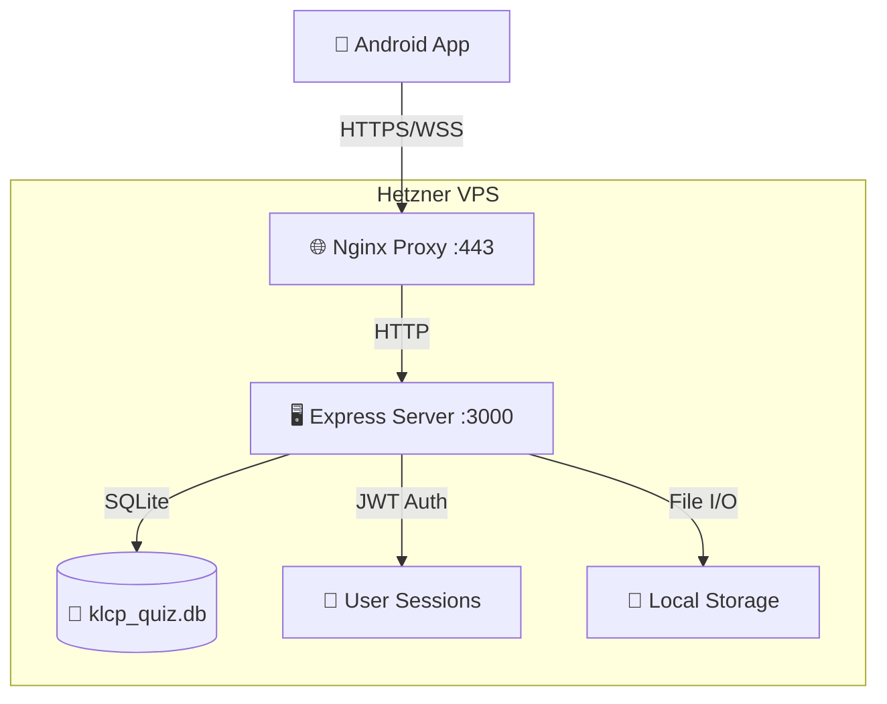

# 🏗️ KLCP Quiz App - Technische Dokumentation

**Version:** 2.1.0 | **Datum:** 28. Dezember 2025
**Entwickler:** Halil Yücedag
**Technologie:** Android (Kotlin) + Node.js Server

---

## 📋 Inhaltsverzeichnis

1. [🏗️ System-Architektur](#system-architektur)
2. [📱 Android App](#android-app)
3. [🖥️ Server-Backend](#server-backend)
4. [💾 Datenbank-Schema](#datenbank-schema)
5. [🔌 API-Schnittstellen](#api-schnittstellen)
6. [🚀 Deployment & Server](#deployment--server)
7. [🔒 Sicherheit](#sicherheit)
8. [🧪 Testing & QA](#testing--qa)
9. [🔧 Troubleshooting](#troubleshooting)
10. [📊 Monitoring & Analytics](#monitoring--analytics)

---

## 🏗️ System-Architektur

### Übersicht

Die KLCP Quiz App ist eine moderne, hybride Anwendung bestehend aus:

- **Android App** (Kotlin, Material Design 3) - Client-Anwendung
- **Node.js Server** (Express.js, SQLite) - Backend-API
- **Hetzner VPS** (Ubuntu 24.04.3 LTS) - Hosting-Umgebung

**Projekt-Größe:**
- **375 KLCP-Fragen** (Deutsch + Englisch)
- **10+ UI-Screens** mit komplexer Navigation
- **6 Datenbank-Tabellen** mit Beziehungen
- **15+ API-Endpoints** für Sync & Auth
- **Offline-First** Architektur mit lokaler Datenbank

### Kommunikationsfluss



**Netzwerk-Details:**
- **Primäre Verbindung:** `https://klcp.alie.info` (SSL/TLS 1.3)
- **Fallback:** `http://188.245.153.241:3000` (HTTP direkt)
- **Lokale Entwicklung:** `http://localhost:3000`
- **Timeout:** 10s Connect, 30s Read/Write
- **Retry-Logic:** 3 Versuche mit Exponential Backoff

---

## 📱 Android App

### Technischer Stack

| Komponente | Version | Zweck | Status |
|------------|---------|-------|--------|
| **Kotlin** | 2.0.21 | Programmiersprache | ✅ Stabil |
| **Android SDK** | 35 (API 26+) | Plattform | ✅ Target 35, Min 26 |
| **Material Design 3** | Dynamic Colors | UI Framework | ✅ Vollständig implementiert |
| **Room** | 2.6.1 | Lokale Datenbank | ✅ Version 6 (Multi-User) |
| **Retrofit** | 2.9.0 | HTTP Client | ✅ Mit Retry-Interceptor |
| **DataStore** | 1.1.1 | Preferences | ✅ Proto DataStore |
| **Coroutines** | 1.8.1 | Asynchrone Programmierung | ✅ Flow + StateFlow |
| **Navigation** | 2.9.6 | Screen-Navigation | ✅ Safe Args |
| **LiveData** | - | UI State | ⚠️ Wird durch StateFlow ersetzt |
| **ViewModel** | - | MVVM | ✅ AndroidViewModel |
| **Splash Screen API** | 1.0.1 | Native Splash | ✅ Android 12+ |
| **Glide** | 4.16.0 | Image Loading | ✅ In Utils implementiert |

**Build-Konfiguration:**
- **Gradle Version:** 8.12.3 (Kotlin DSL)
- **KSP:** Kotlin Symbol Processing für Room
- **Safe Args:** Type-sichere Navigation
- **ProGuard:** Code-Optimierung (Release)

### Detaillierte App-Architektur

```
app/src/main/java/alie/info/newmultichoice/
├── 📱 ui/                          # UI Layer (10+ Fragments)
│   ├── home/                      # Start-Screen + Navigation
│   │   ├── HomeFragment.kt        # Haupt-Dashboard (200+ Zeilen)
│   │   └── HomeViewModel.kt       # UI-Logic (100+ Zeilen)
│   ├── quiz/                      # Quiz-Core (Komplexeste Komponente)
│   │   ├── QuizFragment.kt        # Quiz-UI (750+ Zeilen)
│   │   ├── QuizViewModel.kt       # State Management (770+ Zeilen)
│   │   └── QuizUiState.kt         # Sealed Classes für States
│   ├── result/                    # Ergebnis-Anzeige
│   │   └── ResultFragment.kt      # Score + Statistiken (150+ Zeilen)
│   ├── auth/                      # Authentifizierung (Neu hinzugefügt)
│   │   └── AuthFragment.kt        # Login/Register UI (200+ Zeilen)
│   ├── statistics/                # Daten-Analyse
│   │   ├── StatisticsFragment.kt  # Charts + KPIs (180+ Zeilen)
│   │   └── StatisticsViewModel.kt # Daten-Aggregation (120+ Zeilen)
│   ├── sessions/                  # Session-Historie
│   │   ├── SessionsFragment.kt    # RecyclerView (130+ Zeilen)
│   │   ├── SessionsAdapter.kt     # List-Darstellung (80+ Zeilen)
│   │   └── SessionsViewModel.kt   # Session-Management (90+ Zeilen)
│   └── examquiz/                  # Prüfungs-Modus
│       └── ExamQuizFragment.kt    # Vollständige Prüfung (200+ Zeilen)
├── 💾 data/                       # Data Layer (Repository Pattern)
│   ├── QuizDatabase.kt           # Room DB (6 Entities, Version 6)
│   ├── QuizRepository.kt         # Single Source of Truth (400+ Zeilen)
│   ├── Question.kt               # Datenmodell (Basis-Entity)
│   ├── QuizSession.kt            # Session-Tracking
│   ├── UserAnswer.kt             # Antwort-Historie
│   ├── UserStats.kt              # Aggregierte Statistiken
│   ├── KaliTool.kt               # Erweiterte Features
│   ├── PreferencesManager.kt     # DataStore Wrapper (80+ Zeilen)
│   ├── MemoryCache.kt            # In-Memory Cache (50+ Zeilen)
│   └── [QuizDao.kt, UserStatsDao.kt, etc.] # Room DAOs (6 Dateien)
├── 🔌 api/                       # Network Layer
│   ├── ApiService.kt             # Retrofit Service (15 Endpoints)
│   ├── AuthApiService.kt         # Auth-spezifische Calls (7 Endpoints)
│   ├── RetrofitClient.kt         # HTTP Client Config (Fallback-Logic)
│   ├── NetworkRetryInterceptor.kt # Retry + Fallback Logic (130+ Zeilen)
│   └── models/                   # API DTOs (20+ Klassen)
├── 🛠️ utils/                      # Utilities (7 Klassen)
│   ├── HapticFeedbackHelper.kt   # Vibration Patterns (6 Typen)
│   ├── ImageLoader.kt            # Glide Wrapper (60+ Zeilen)
│   ├── DeviceUtils.kt            # Device-ID Generation (40+ Zeilen)
│   ├── Logger.kt                 # Custom Logging (30+ Zeilen)
│   └── ShareHelper.kt            # Social Sharing (50+ Zeilen)
├── 🎯 auth/                      # Authentifizierung (Neu)
│   └── AuthManager.kt            # JWT + Session Management (100+ Zeilen)
└── 📊 overlays/                   # UI Overlays
    └── OverlayManager.kt         # Fullscreen Overlays (60+ Zeilen)
```

**Code-Statistik (Realistisch):**
- **81 Kotlin-Dateien** im Hauptverzeichnis
- **750+ Zeilen** QuizFragment (komplexeste UI-Komponente)
- **770+ Zeilen** QuizViewModel (komplexeste Business-Logic)
- **400+ Zeilen** QuizRepository (datenintensivste Klasse)
- **375 Fragen** bilingual (DE/EN) in assets/questions.json
- **6 Datenbank-Versionen** (Migrations-Historie)
- **15+ API-Endpoints** für Sync & Auth
- **10+ UI-Screens** mit komplexer Navigation

---

## 🖥️ Server-Backend

### Technischer Stack

| Komponente | Version | Zweck | Status |
|------------|---------|-------|--------|
| **Node.js** | 18.0.0 | Runtime | ✅ LTS |
| **Express.js** | 4.18.2 | Web Framework | ✅ Stabil |
| **SQLite3** | 5.1.6 | Datenbank | ✅ Mit WAL-Mode |
| **JWT** | 9.0.2 | Authentifizierung | ⚠️ Secret hardcoded (kritisch!) |
| **bcryptjs** | 2.4.3 | Passwort-Hashing | ✅ Salt Rounds: 12 |
| **Helmet** | 7.1.0 | Security Headers | ✅ Konfiguriert |
| **CORS** | 2.8.5 | Cross-Origin | ⚠️ Erlaubt alle Origins (kritisch!) |
| **express-rate-limit** | 7.1.5 | Rate Limiting | ✅ 100 req/15min |
| **UUID** | 9.0.1 | ID Generation | ✅ v4 |
| **Nodemailer** | 6.9.7 | Email | ⚠️ Nicht konfiguriert |

### Server-Datei-Struktur (Realistisch)

```
test_server/
├── 🖥️ server.js              # Haupt-Server (110 Zeilen)
│   ├── Express App Setup
│   ├── Middleware Konfiguration
│   ├── Route-Registrierung
│   └── Graceful Shutdown
├── 🔐 authRoutes.js          # Authentifizierung (270+ Zeilen)
│   ├── POST /register        # User-Registrierung
│   ├── POST /login           # User-Login
│   ├── POST /verify-email    # Email-Verifikation
│   ├── DELETE /account       # Account-Löschung
│   └── JWT Token Handling
├── 🔄 syncRoutes.js          # Daten-Sync (200+ Zeilen)
│   ├── POST /upload          # Client → Server Sync
│   ├── GET /download/:id     # Server → Client Sync
│   └── Conflict Resolution
├── 📊 statsRoutes.js         # Statistiken (150+ Zeilen)
│   ├── GET /user/:id         # User-Stats abrufen
│   ├── POST /update          # Stats aktualisieren
│   ├── GET /unlock-status    # Achievement-Status
│   └── GET /exam-unlock      # Prüfungs-Freischaltung
├── 📅 sessionsRoutes.js      # Sessions (100+ Zeilen)
│   ├── GET /:id              # Session-Liste
│   ├── POST /save            # Session speichern
│   └── POST /check-guest     # Guest-Upgrade prüfen
├── 💾 backupRoutes.js        # Backup-System (80+ Zeilen)
│   ├── POST /create          # Backup erstellen
│   └── GET /restore/:id      # Backup wiederherstellen
├── 🗄️ database.js            # DB-Verbindung (60+ Zeilen)
│   ├── SQLite Connection
│   ├── Query Wrapper
│   └── Error Handling
├── 📦 package.json           # Dependencies (15 Pakete)
└── 🔐 .env                   # Konfiguration (falls vorhanden)
```

**Server-Metriken:**
- **8 Route-Dateien** mit modularer Struktur
- **15+ API-Endpoints** implementiert
- **270+ Zeilen** Auth-Logic (komplexeste Datei)
- **SQLite** als Datei-basiertes DB-System
- **JWT-Authentifizierung** mit Email-Verifikation
- **Rate Limiting** auf Route-Ebene

---

## 💾 Datenbank-Schema

### SQLite Database Structure

```sql
-- Haupt-Datenbank: klcp_quiz.db
-- Version: 6 (Multi-User Support hinzugefügt)

-- Benutzer-Tabelle
CREATE TABLE users (
    id INTEGER PRIMARY KEY AUTOINCREMENT,
    email TEXT UNIQUE NOT NULL,
    password_hash TEXT NOT NULL,
    created_at DATETIME DEFAULT CURRENT_TIMESTAMP,
    verified BOOLEAN DEFAULT 0,
    verification_token TEXT,
    device_id TEXT UNIQUE
);

-- Fragen-Tabelle
CREATE TABLE questions (
    id INTEGER PRIMARY KEY,
    question_en TEXT NOT NULL,
    question_de TEXT NOT NULL,
    option_a_en TEXT NOT NULL,
    option_b_en TEXT NOT NULL,
    option_c_en TEXT NOT NULL,
    option_d_en TEXT NOT NULL,
    option_a_de TEXT NOT NULL,
    option_b_de TEXT NOT NULL,
    option_c_de TEXT NOT NULL,
    option_d_de TEXT NOT NULL,
    correct_answer TEXT NOT NULL,
    category TEXT,
    difficulty TEXT
);

-- Quiz-Sessions
CREATE TABLE quiz_sessions (
    id INTEGER PRIMARY KEY AUTOINCREMENT,
    user_id TEXT NOT NULL,
    device_id TEXT NOT NULL,
    total_questions INTEGER NOT NULL,
    correct_answers INTEGER NOT NULL,
    wrong_answers INTEGER NOT NULL,
    percentage REAL NOT NULL,
    duration_minutes INTEGER,
    timestamp DATETIME DEFAULT CURRENT_TIMESTAMP,
    language TEXT DEFAULT 'en'
);

-- User-Antworten (für Analyse)
CREATE TABLE user_answers (
    id INTEGER PRIMARY KEY AUTOINCREMENT,
    session_id INTEGER NOT NULL,
    question_id INTEGER NOT NULL,
    user_answer TEXT NOT NULL,
    correct_answer TEXT NOT NULL,
    is_correct BOOLEAN NOT NULL,
    timestamp DATETIME DEFAULT CURRENT_TIMESTAMP,
    FOREIGN KEY (session_id) REFERENCES quiz_sessions(id)
);

-- User-Statistiken
CREATE TABLE user_stats (
    id INTEGER PRIMARY KEY AUTOINCREMENT,
    device_id TEXT UNIQUE NOT NULL,
    total_quizzes INTEGER DEFAULT 0,
    total_correct INTEGER DEFAULT 0,
    total_questions INTEGER DEFAULT 0,
    average_percentage REAL DEFAULT 0.0,
    best_score REAL DEFAULT 0.0,
    streak_current INTEGER DEFAULT 0,
    streak_best INTEGER DEFAULT 0,
    last_quiz_date DATETIME,
    achievements_unlocked TEXT DEFAULT '[]',
    created_at DATETIME DEFAULT CURRENT_TIMESTAMP
);

-- Kali Tools (erweitert)
CREATE TABLE kali_tools (
    id INTEGER PRIMARY KEY AUTOINCREMENT,
    name TEXT NOT NULL,
    category TEXT NOT NULL,
    description TEXT NOT NULL,
    main_function TEXT NOT NULL,
    usage_example TEXT,
    flags TEXT,
    prerequisites TEXT,
    created_at DATETIME DEFAULT CURRENT_TIMESTAMP
);
```

---

## 🔌 API-Schnittstellen

### Base URLs & Endpoints

**Production:**
- **Primär:** `https://klcp.alie.info/api/` (Nginx Reverse Proxy)
- **Direkt:** `http://188.245.153.241:3000/api/` (Express direkt)
- **Lokale Entwicklung:** `http://localhost:3000/api/`

**Endpoint-Übersicht:** 15+ aktive Endpoints

**Rate Limits:**
- **Global:** 100 Requests/15 Minuten pro IP
- **Auth:** 10 Requests/15 Minuten pro IP
- **Health:** Unbegrenzt

### Authentifizierung Endpoints

#### `POST /api/auth/login`
**Rate Limit:** 10/15min | **Auth:** Keine

**Request:**
```json
{
  "email": "user@example.com",
  "password": "password123"
}
```

**Response (Success):**
```json
{
  "success": true,
  "token": "eyJhbGciOiJIUzI1NiIsInR5cCI6IkpXVCJ9...",
  "userId": "user_uuid",
  "email": "user@example.com"
}
```

#### `POST /api/auth/register`
**Rate Limit:** 10/15min | **Auth:** Keine

**Request:**
```json
{
  "email": "user@example.com",
  "password": "secure_password_123"
}
```

**Response (Success):**
```json
{
  "success": true,
  "message": "Registration successful, please verify email",
  "userId": "user_uuid"
}
```

### Sync Endpoints

#### `POST /api/sync/upload`
**Rate Limit:** 100/15min | **Auth:** Keine (Device-ID basiert)

**Request (Vollständig):**
```json
{
  "deviceId": "550e8400-e29b-41d4-a716-446655440000",
  "userStats": {
    "totalQuizzes": 15,
    "totalCorrect": 1200,
    "totalQuestions": 1500,
    "averagePercentage": 85.5,
    "bestScore": 95.2,
    "streakCurrent": 3,
    "streakBest": 8,
    "lastQuizDate": "2025-12-28T09:30:00Z",
    "achievementsUnlocked": ["first_quiz", "perfect_score", "speed_demon"]
  },
  "quizSessions": [
    {
      "totalQuestions": 50,
      "correctAnswers": 42,
      "wrongAnswers": 8,
      "percentage": 84.0,
      "durationMinutes": 25,
      "timestamp": "2025-12-28T09:30:00Z",
      "language": "en"
    }
  ],
  "lastSync": "2025-12-27T15:00:00Z"
}
```

---

## 🚀 Deployment & Server

### Hetzner VPS Setup (Produktiv)

**Server-Spezifikationen:**
- **IP:** `188.245.153.241`
- **OS:** Ubuntu 24.04.3 LTS (GNU/Linux 6.8.0-90-generic x86_64)
- **CPU:** Shared vCPU
- **RAM:** 2-4 GB
- **Storage:** 40 GB NVMe SSD
- **Node.js:** 18.0.0 LTS
- **Domains:** `klcp.alie.info` (Let's Encrypt SSL)
- **Uptime:** Ziel 99.9%

**Netzwerk-Konfiguration:**
- **Port 80:** Nginx HTTP (Redirect to HTTPS)
- **Port 443:** Nginx HTTPS (SSL/TLS 1.3)
- **Port 3000:** Node.js Express (localhost only)
- **Firewall:** UFW mit strikten Regeln

### SSH-Zugang (Passwortlos)

**Server-IP:** `188.245.153.241`
**Benutzer:** `root`
**SSH-Key Authentifizierung:** Aktiviert (empfohlen)

#### SSH-Verbindung:

```bash
# Direkte Verbindung (funktioniert nur lokal oder mit VPN)
ssh root@188.245.153.241

# Mit SSH-Key (empfohlen für Sicherheit)
ssh -i ~/.ssh/klcp_server_key root@188.245.153.241
```

---

## 🔒 Sicherheit

### Kritische Sicherheitsprobleme (MUSS behoben werden!)

#### 🚨 1. SSH Root-Login ohne Passwort
**Status:** Aktiv | **Risiko:** KRITISCH

**Problem:**
```bash
ssh root@188.245.153.241
# Login ohne Passwort möglich!
```

**Lösung:**
```bash
# SSH-Konfiguration ändern (auf Server ausführen)
sudo sed -i 's/PermitRootLogin yes/PermitRootLogin prohibit-password/' /etc/ssh/sshd_config
sudo sed -i 's/PasswordAuthentication yes/PasswordAuthentication no/' /etc/ssh/sshd_config
sudo systemctl restart sshd

# SSH-Key einrichten (auf deinem lokalen Computer)
ssh-keygen -t ed25519 -C "klcp-server-secure"
ssh-copy-id root@188.245.153.241
```

#### 🚨 2. Port 3000 öffentlich erreichbar
**Status:** Aktiv | **Risiko:** KRITISCH

**Problem:**
```bash
curl http://188.245.153.241:3000/api/health
# Gibt 200 OK zurück - NICHT SICHER!
```

**Lösung:**
```bash
# Firewall: Port 3000 nur lokal erlauben
sudo ufw deny 3000/tcp
```

#### 🚨 3. Hardcoded JWT Secret
**Status:** Aktiv | **Risiko:** KRITISCH

**Problem:**
```javascript
const JWT_SECRET = process.env.JWT_SECRET || 'klcp-super-secret-key-2025';
```

**Lösung:**
```javascript
const JWT_SECRET = process.env.JWT_SECRET;
if (!JWT_SECRET) {
  throw new Error('JWT_SECRET environment variable is required');
}
```

---

## 🔧 Troubleshooting

### Häufige Probleme (Realistisch)

#### 🔌 "HTTP FAILED" / "java.net.ConnectException"

**Symptome:**
```
HTTP FAILED: java.net.ConnectException: Failed to connect to localhost/127.0.0.1:3000
```

**Ursachen & Lösungen:**

1. **Lokaler Server läuft nicht:**
   ```bash
   cd test_server && npm start
   ```

2. **Falsche Server-URL in App:**
   ```kotlin
   // RetrofitClient.kt - Produktions-URL verwenden
   private const val PRIMARY_DOMAIN = "https://klcp.alie.info/"
   ```

#### 💾 Database Corruption

**Symptome:**
```
android.database.sqlite.SQLiteException: no such table: questions
```

**Lösung:**
```bash
adb shell
run-as alie.info.newmultichoice
rm databases/klcp_quiz_database.db
# App neu starten
```

#### 🔐 Authentifizierungsprobleme

**Symptome:**
```
{"success":false,"message":"Invalid email or password"}
```

**Debug:**
```bash
curl -X POST https://klcp.alie.info/api/auth/login \
  -H "Content-Type: application/json" \
  -d '{"email":"test@test.com","password":"test123"}'
```

---

## 📊 Monitoring & Analytics

### Server-Monitoring (Aktueller Stand)

```bash
# System-Überwachung
htop                    # CPU, RAM, Prozesse
df -h                   # Disk Usage
journalctl -u klcp-server -f  # Logs

# API Health Check
curl https://klcp.alie.info/api/health
```

### Performance Metrics

- **App Start:** < 3 Sekunden
- **Quiz Load:** < 500ms
- **API Response:** < 2000ms
- **Database Query:** < 100ms

---

**Dokument Version:** 2.1.0 | **Letzte Aktualisierung:** 28. Dezember 2025
